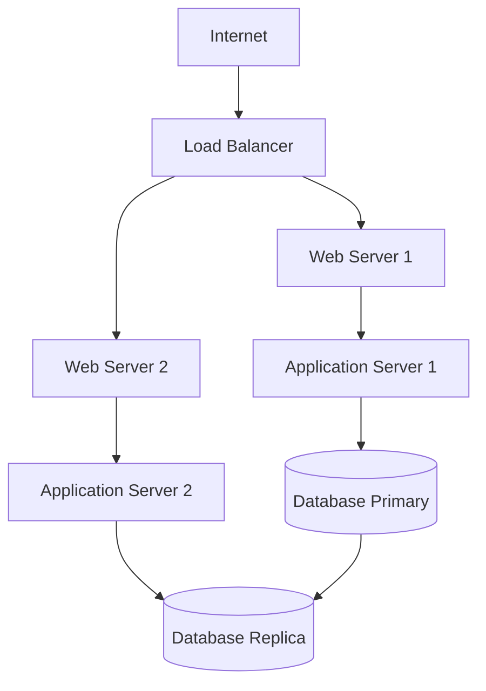
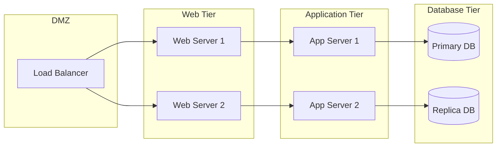

# Network Topology

## Overview

This document describes the network topology and hardware configuration of the system.

## Network Architecture

### Physical Layout

### Network Segments

## Hardware Specifications

### Server Configuration

| Component | Specification | Quantity |
|-----------|---------------|----------|
| CPU | Intel Xeon E5-2680 v4 | 2 per server |
| RAM | 64GB DDR4 | 4x16GB modules |
| Storage | 2TB SSD | 2 drives (RAID 1) |
| Network | 10GbE | 2 ports |

### Network Equipment

- **Load Balancer**: F5 BIG-IP 3900
- **Switches**: Cisco Catalyst 9300
- **Firewall**: Palo Alto PA-5220
- **Routers**: Cisco ISR 4321

## Security Zones

1. **DMZ**: Public-facing services
2. **Web Tier**: Web servers
3. **Application Tier**: Business logic servers
4. **Database Tier**: Data storage (restricted access)

## Monitoring Points

- Network traffic monitoring at each tier
- Server health monitoring
- Database performance metrics
- Security event logging 